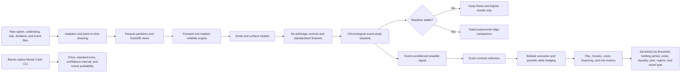

# Architecture

The package is separated into five main areas:

- `vol_platform.data`: adapters, validation, alignment, storage, and data-quality reports.
- `vol_platform.pricing`: Black-Scholes, Black-76, Greeks, implied volatility, parity, and Monte Carlo pricing.
- `vol_platform.surface`: forwards, dividends, arbitrage diagnostics, smile models, standardized deltas, and surface features.
- `vol_platform.event_study`: point-in-time event windows, chronological models, stability checks, and research diagnostics.
- `vol_platform.strategy`: exact option-contract execution, delta hedging, P&L attribution, risk metrics, and sensitivity analysis.

Generated analytical tables are written to Parquet and CSV. DuckDB files provide local SQL access without requiring a server.
